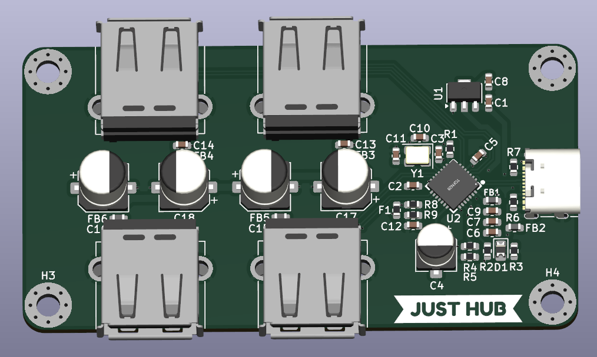

  

---

<h1 align="center">Just HUB</h1>

 <small><I>It is Just Hub.<I></small>

  <b>Just HUB is very simple 4 port USB hub based on the GL852G chip.</b>
   
  <b>It is designed for Hackclub fallout, because I needed few more hours to fly out to Shenzhen! </b>
   

## Features

**4x USB-A ports**

**Just one USB-C cable gives out 4 USB-A ports**

**and thats all because IT IS JUST HUB lol**

---
## How to build it:
 - You just buy all of the components and PCBs
 - Solder everything in place
 - Print enclosure
 - Put board into the enclousre and just tigthen the screw
 - And then just plug it in and id sholud work! 
---
## Zine

  

## Images

  
  

## ⚖️ License

This project is licensed under the **Creative Commons Attribution-NonCommercial-ShareAlike 4.0 International (CC BY-NC-SA 4.0)** License.

[![CC BY-NC-SA 4.0][cc-by-nc-sa-shield]][cc-by-nc-sa]

You are free to share and adapt this material under the following terms:
* **Attribution** — You must give appropriate credit to the original author.
* **NonCommercial** — You may not use the material for commercial purposes.
* **ShareAlike** — If you remix, transform, or build upon the material, you must distribute your contributions under the same license.

[cc-by-nc-sa]: http://creativecommons.org/licenses/by-nc-sa/4.0/
[cc-by-nc-sa-shield]: https://img.shields.io/badge/License-CC%20BY--NC--SA%204.0-lightgrey.svg

## BOM

| Item No. | Qty. | Value | MPN (Part Number) | LCSC | Datasheet | Unit Price ($) | Total Price ($) |
| --- | --- | --- | --- | --- | --- | --- | --- |
| 1 | 5 | `1uF` | CL10A105KO8NNNC | [C1592](https://www.lcsc.com/product-detail/C1592.html) | [PDF](https://www.lcsc.com/datasheet/C1592.pdf) | 0.0124 | 0.0620 |
| 2 | 8 | `100nF` | CL10B104KO8NNNC | [C66501](https://www.lcsc.com/product-detail/C66501.html) | [PDF](https://www.lcsc.com/datasheet/C66501.pdf) | 0.0073 | 0.0584 |
| 3 | 1 | `10uF` | RVT1H100M0505 | [C72487](https://www.lcsc.com/product-detail/C72487.html) | [PDF](https://www.lcsc.com/datasheet/C72487.pdf) | 0.0284 | 0.0284 |
| 4 | 2 | `20pF` | TCC0603COG200J101CT | [C880611](https://www.lcsc.com/product-detail/C880611.html) | [PDF](https://www.lcsc.com/datasheet/C880611.pdf) | 0.0034 | 0.0068 |
| 5 | 4 | `100uF` | RVT1V101M0607 | [C72478](https://www.lcsc.com/product-detail/C72478.html) | [PDF](https://www.lcsc.com/datasheet/C72478.pdf) | 0.0304 | 0.1216 |
| 6 | 1 | `LED` | XL-2012SURC | [C965812](https://www.lcsc.com/product-detail/C965812.html) | [PDF](https://www.lcsc.com/datasheet/C965812.pdf) | 0.0070 | 0.0070 |
| 7 | 1 | `35V2A` | F06F2TH | [C41398700](https://www.lcsc.com/product-detail/C41398700.html) | [PDF](https://www.lcsc.com/datasheet/C41398700.pdf) | 0.0314 | 0.0314 |
| 8 | 6 | `600ohm/100mhz` | SCBG160808U601T | [C480860](https://www.lcsc.com/product-detail/C480860.html) | - | 0.0042 | 0.0252 |
| 9 | 1 | `USB_C_Receptacle_USB2.0_16P` | TYPE-C 16PIN 2MD(073) | [C2765186](https://www.lcsc.com/product-detail/C2765186.html) | [PDF](https://www.lcsc.com/datasheet/C2765186.pdf) | 0.0707 | 0.0707 |
| 10 | 4 | `USB_A` | AF 90 WJDG | [C456018](https://www.lcsc.com/product-detail/C456018.html) | [PDF](https://www.lcsc.com/datasheet/C456018.pdf) | 0.0485 | 0.1940 |
| 11 | 2 | `680R` | GR0603F680RT5G00 | [C49653123](https://www.lcsc.com/product-detail/C49653123.html) | [PDF](https://www.lcsc.com/datasheet/C49653123.pdf) | 0.0012 | 0.0024 |
| 12 | 1 | `100k` | FRC0603F1003TS | [C2906980](https://www.lcsc.com/product-detail/C2906980.html) | [PDF](https://www.lcsc.com/datasheet/C2906980.pdf) | 0.0019 | 0.0019 |
| 13 | 2 | `30k` | 0603WAF3002T5E | [C22984](https://www.lcsc.com/product-detail/C22984.html) | [PDF](https://www.lcsc.com/datasheet/C22984.pdf) | 0.0018 | 0.0036 |
| 14 | 2 | `5.1k` | 1RC0603F5101 | [C53224208](https://www.lcsc.com/product-detail/C53224208.html) | [PDF](https://www.lcsc.com/datasheet/C53224208.pdf) | 0.0014 | 0.0028 |
| 15 | 1 | `10k` | CR0603JA0103G | [C101254](https://www.lcsc.com/product-detail/C101254.html) | [PDF](https://www.lcsc.com/datasheet/C101254.pdf) | 0.0016 | 0.0016 |
| 16 | 1 | `47k` | CL0603JN47KP | [C46635305](https://www.lcsc.com/product-detail/C46635305.html) | [PDF](https://www.lcsc.com/datasheet/C46635305.pdf) | 0.0011 | 0.0011 |
| 17 | 1 | `AMS1117-3.3` | AMS1117-3.3OF | [C50313802](https://www.lcsc.com/product-detail/C50313802.html) | [PDF](https://www.lcsc.com/datasheet/C50313802.pdf) | 0.0338 | 0.0338 |
| 18 | 1 | `GL852G-OHY60_C7501404` | GL852G-OHY60 | [C7501404](https://www.lcsc.com/product-detail/C7501404.html) | [PDF](https://www.lcsc.com/datasheet/C7501404.pdf) | 1.0751 | 1.0751 |
| 19 | 1 | `12MHz` | K3A120002010 | [C368730](https://www.lcsc.com/product-detail/C368730.html) | [PDF](https://www.lcsc.com/datasheet/C368730.pdf) | 0.0580 | 0.0580 |
| 20 | 1 | `PCB` | - | - | - | 2.0000 | 2.0000 |
| 21 | 1 | `3D Printing` | - | - | - | Free | 0.0000 |
| 22 | 4 | `M3x12mm screws` | - | - | - | - | 0.0782 |
| **Total** |  |  |  |  |  |  | **$$3.8640** |
