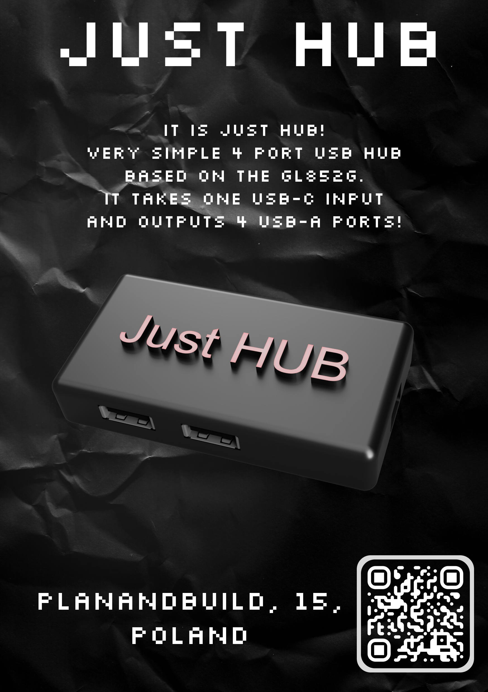

  

---

<h1 align="center">Just HUB</h1>

 <small><I>It is Just Hub.<I></small>

  <b>Just HUB is very simple 4 port USB hub based on the GL852G chip.</b>
   
  <b>It is designed for Hackclub fallout, because I needed few more hours to fly out to Shenzhen! </b>
   

## Features

**4x USB-A ports**

**Just one USB-C cable gives out 4 USB-A ports**

**and thats all because IT IS JUST HUB lol**

---

## Zine

  

## ⚖️ License

This project is licensed under the **Creative Commons Attribution-NonCommercial-ShareAlike 4.0 International (CC BY-NC-SA 4.0)** License.

[![CC BY-NC-SA 4.0][cc-by-nc-sa-shield]][cc-by-nc-sa]

You are free to share and adapt this material under the following terms:
* **Attribution** — You must give appropriate credit to the original author.
* **NonCommercial** — You may not use the material for commercial purposes.
* **ShareAlike** — If you remix, transform, or build upon the material, you must distribute your contributions under the same license.

[cc-by-nc-sa]: http://creativecommons.org/licenses/by-nc-sa/4.0/
[cc-by-nc-sa-shield]: https://img.shields.io/badge/License-CC%20BY--NC--SA%204.0-lightgrey.svg
